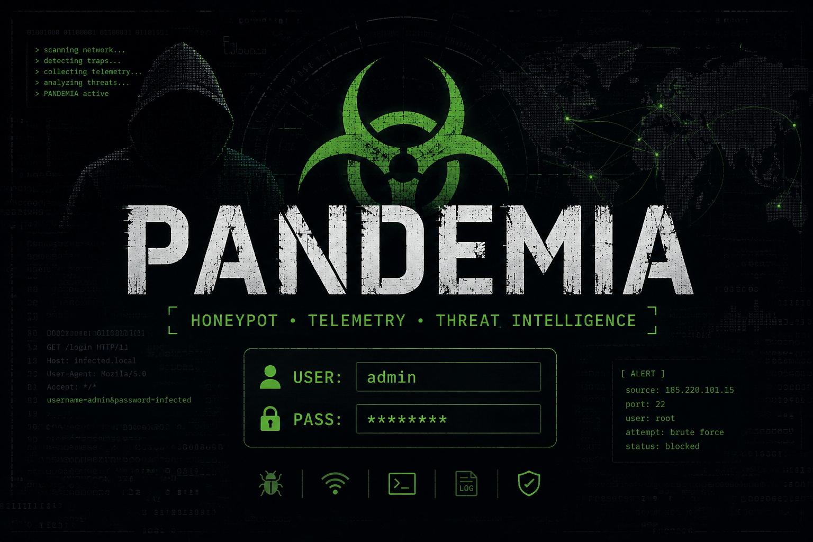

# pandemia



Real-world credential dictionaries, captured live from a controlled honeypot environment ([Oráculo SOC](https://github.com/drplagash)). No synthetic data, no scraped lists — every entry here was actually typed by a real attacker against a real (emulated) service.

Updated automatically, every 12 hours.

## What's in here

Always the latest snapshot, right at the root:

| File | Content | Format |
|---|---|---|
| [`usernames.txt`](usernames.txt) | Unique usernames, most-attempted first | one per line |
| [`plagayou.txt`](plagayou.txt) | Unique passwords, most-attempted first | one per line |
| [`combos.txt`](combos.txt) | Real `username:password` pairs as they were actually attempted together (not a cross-product of the two lists above) | `user:pass`, one per line |

`plagayou.txt` is a nod to `rockyou.txt` — same idea, different source: this one comes straight from live SSH/Telnet brute-force traffic, not a leaked database.

Looking for the commands and full attack sessions attackers typed? That's a separate repo: [yersinia](https://github.com/drplagash/yersinia).

### `archivo/` — history, flat

Every time the dictionaries regenerate, the previous snapshot moves here before being overwritten — nothing is ever lost, but nothing here is "current" either. Flat folder, no subfolders: old files just get a `-DD-MM-HHMM` suffix added to their name and get dropped in (e.g. `combos-01-09-1451.txt`). Think recycle bin, not a dated archive tree.

## Source

Captured via [Cowrie](https://github.com/cowrie/cowrie) (SSH/Telnet honeypot) running as part of a [T-Pot](https://github.com/telekom-security/tpotce) deployment. Only login attempts are used here — no infrastructure details, source IPs, or internal topology are published.

## Updates

The dictionaries regenerate fully every run (full event history, not a delta) — counts only grow. See [CHANGELOG.md](CHANGELOG.md) for a per-run summary.

## Usage

Straight `wordlist` format — drop any of these files into Hydra, Medusa, John, Hashcat, or your tool of choice as-is. `combos.txt` uses the `user:pass` convention (colon-separated).

```bash
hydra -C combos.txt ssh://target
```

## Disclaimer

For security research and authorized testing only. These are real attacker-supplied credentials collected in a controlled, isolated lab — use responsibly and only against systems you're authorized to test.

## License

MIT — see [LICENSE](LICENSE).
